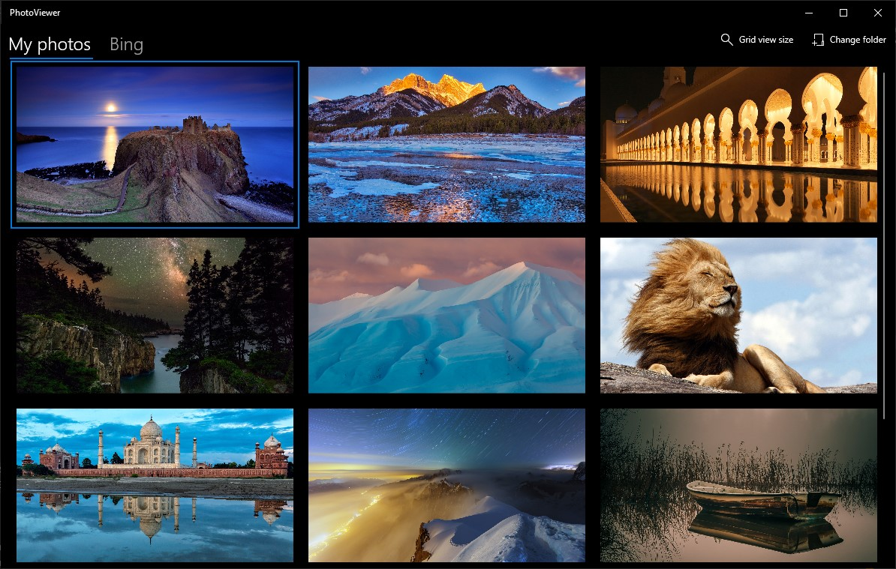
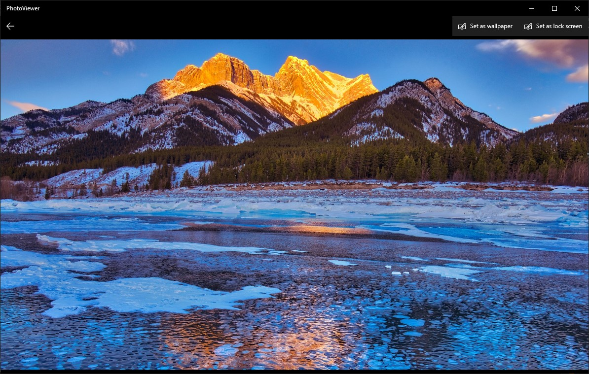

# PV178 Project - PhotoViewer

**PhotoViewer is a UWP application for viewing images from a local folder and the Bing images of the day.**

## Instructions

**IMPORTANT:** Before building the solution, make sure the Solution Platform is set to x86 or x64, not ARM.

After running the app, try clicking on the images and setting them as desktop or lock screen wallpapers.
You can select your own image folder by clicking on the "Change folder" button.

Try also navigating to the Bing tab, which contains the Bing Image of the Day of the last 8 days, 
and set one as your wallpaper ;)
Note: There are 8 Bing images because the web XML does not provide more.

*Author: Attila Zsíros*